### 📄 CHANGES.md

#### 🚀 Overview

This document outlines the changes made to refactor and improve the legacy **User Management API** for better maintainability, security, and clarity, while ensuring the original functionality remains intact.

---

### 🔍 Major Issues Identified

1. **Security**

    * Passwords stored in plaintext.
    * No validation for password complexity.
    * Exposed password fields in responses.

2. **Code Structure**

    * All code in `app.py`.
    * No separation between routes, logic, and utilities.

3. **Best Practices**

    * Improper HTTP status codes.
    * No consistent error messages.
    * Repetitive logic and no reusable utilities.

4. **Testing & Validation**

    * No test coverage.
    * No validation for missing or malformed inputs.

---

### ✅ Key Changes Made

#### 🔐 Security

* Hashed all passwords using `werkzeug.security`.
* Input validation added for email and password strength (minimum 8 characters, includes letter, number, special char).
* Passwords hidden from all API responses.

#### 📁 Code Organization

* Separated routes into `routes/users.py`.
* Added `utils/security.py` and `utils/validators.py` for helpers.
* Moved route registration to `routes/__init__.py`.

#### 💻 API Behavior

* Used correct HTTP status codes (`201`, `400`, `404`, `409`, `401`).
* Provided meaningful and consistent error messages.
* Responses now follow a clean JSON schema.

#### ✅ Testing

* Added `tests/test_users.py` with 9 test cases:

    * Registration (valid, duplicate, missing fields)
    * Login (success, invalid password, missing fields)
    * Get user by ID (valid, invalid)
    * Password strength
* Used Flask's test client and Pytest.

#### 📸 Postman Screenshots

* Created a folder `postman_screenshots/` with test evidence.
* Screenshots include successful and failed API calls.

---

### 🔁 Trade-offs & Assumptions

* Used raw SQL instead of SQLAlchemy for simplicity.
* Did not implement environment config (`.env`) to reduce complexity.
* Assumed `email` must be unique per user.
* Passwords must be 8+ characters with required complexity (no extra flexibility).

---

### Folder Structure
messy-migration/
├── app/
│   ├── __init__.py
│   ├── routes.py
│   ├── database.py
│   └── utils/
│       └── security.py
├── tests/
│   └── test_users.py
├── users.db
├── run.py
└── CHANGES.md

### 💡 With More Time, I Would:

* Add Marshmallow for schema validation.
* Add pagination for `/users`.
* Add user sessions/token-based login (e.g., JWT).
* Use SQLAlchemy ORM.
* Add Docker support for consistent setup.

---

### 🤖 AI Tools Used

* **ChatGPT** for code guidance, refactoring suggestions, and test generation.
* All AI-generated code was reviewed and customized manually.

---

### ✅ Final Checklist

* App runs with:

  ```bash
  python initdb.py
  python app.py
  ```
* All test cases pass:

  ```bash
  pytest tests/
  ```
* `requirements.txt` included.
* `README.md` and `CHANGES.md` updated.
* `postman_screenshots/` included.
* No unnecessary features added.

---
## 📸 Postman Screenshots

### 🏠 Home Page
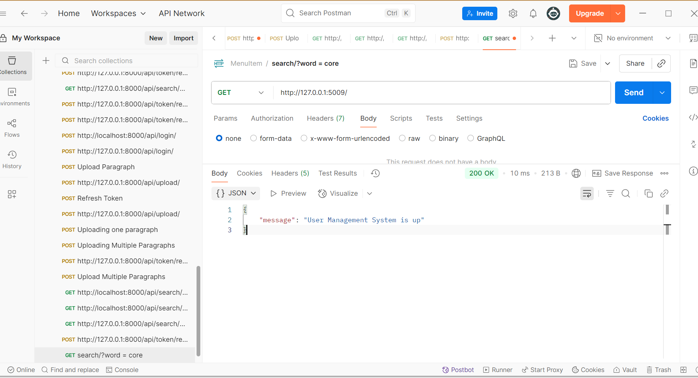

### 🔐 Login Success (200)
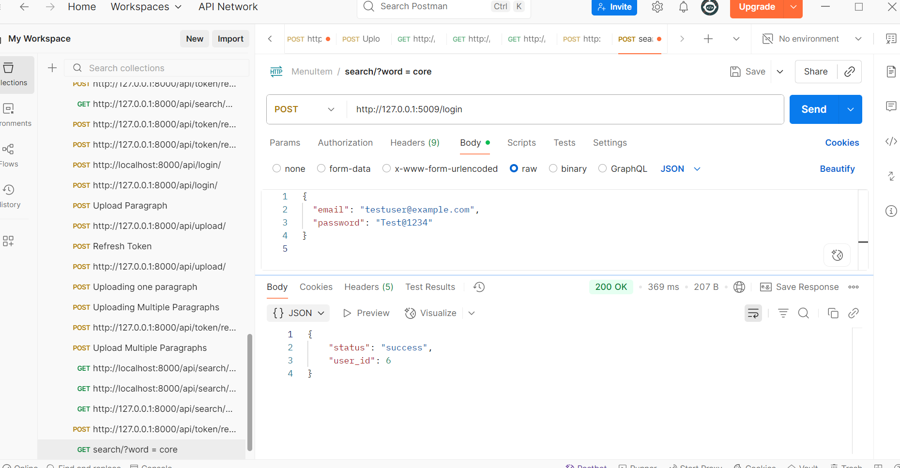

### ❌ Login Failure (401)
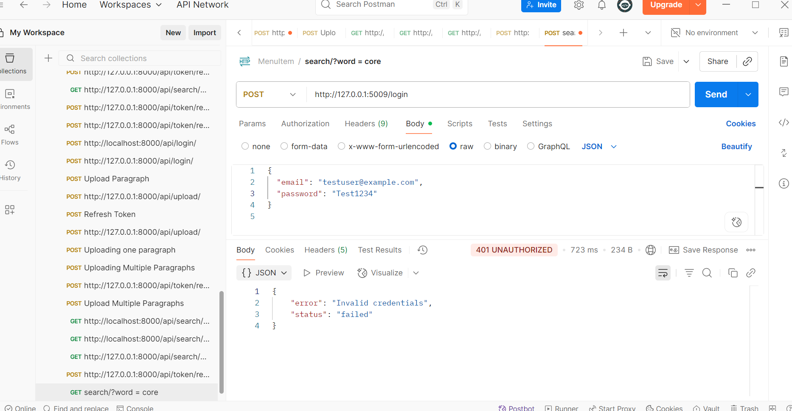

### 🔍 Search Success (200)
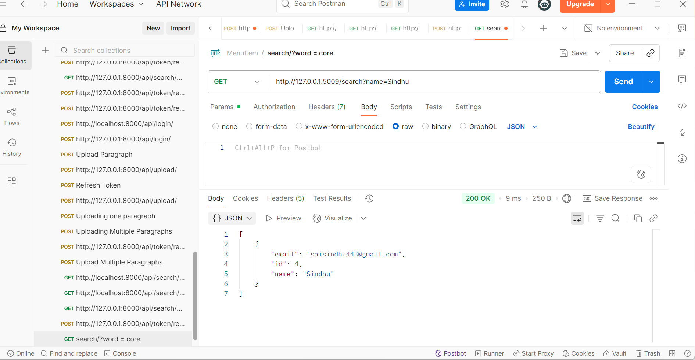

### 🚫 Search Error (400)
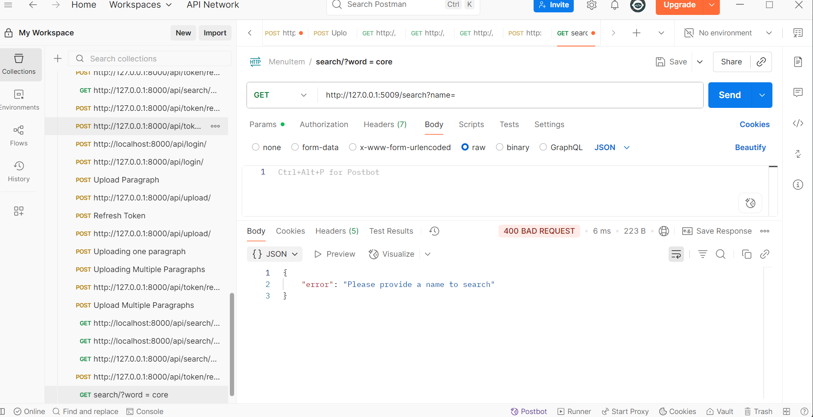

### 🔍 Search Empty Result (200)
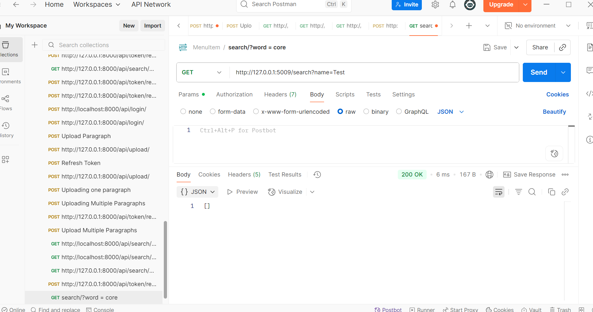

### 👤 User Created (201)
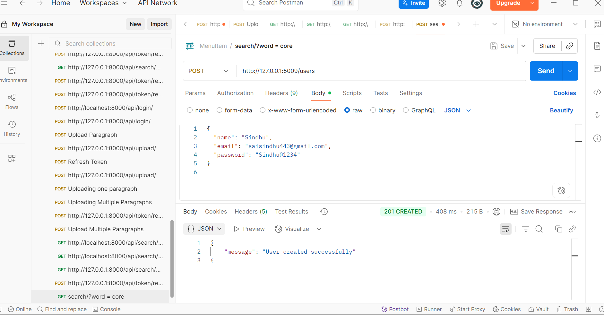

### ❌ User Creation Failed (400)


### 🔁 User Updated (PUT - 200)
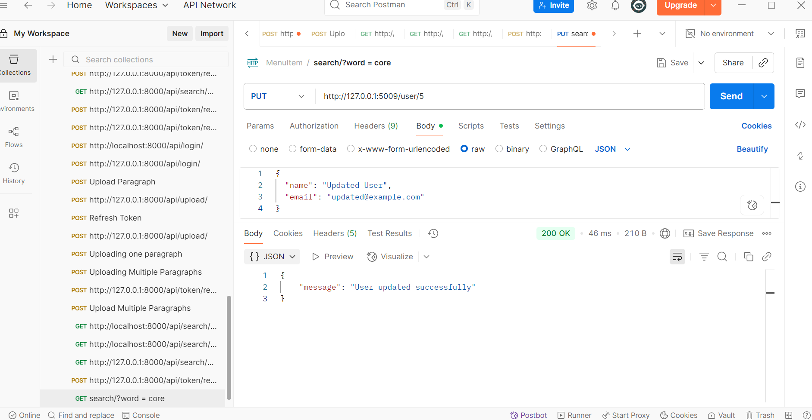

### 👤 User by ID Found (200)
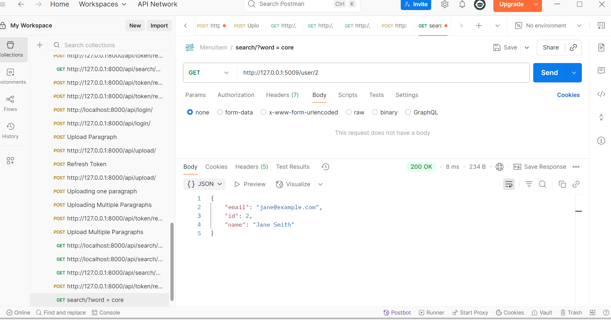

### ❓ User Not Found (404)
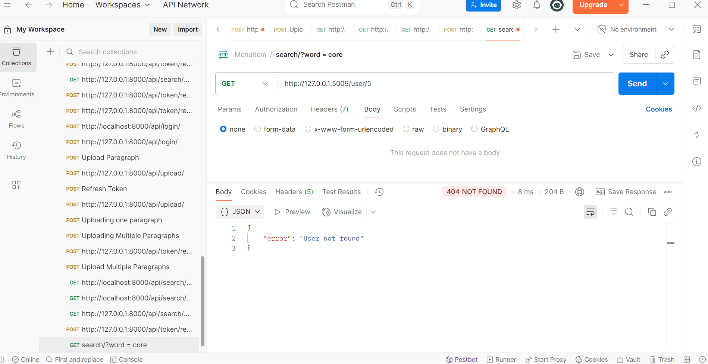

### 🗑️ User Deleted (204)
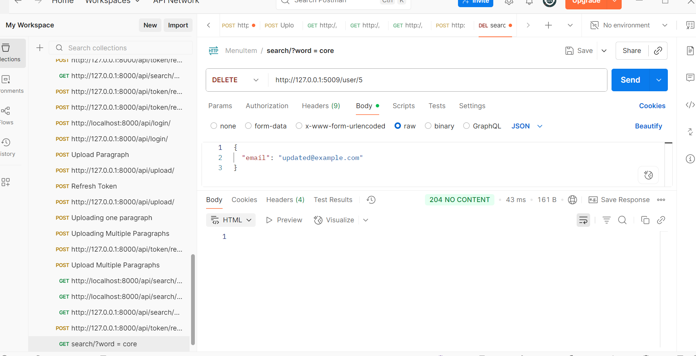

### 🔁 User Update Failed (PUT - 400)
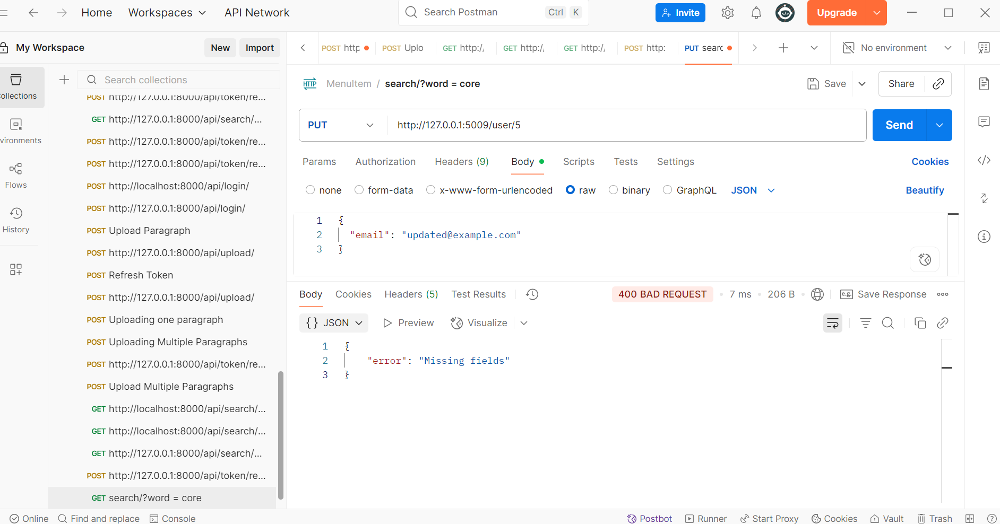

### 👥 All Users (200)
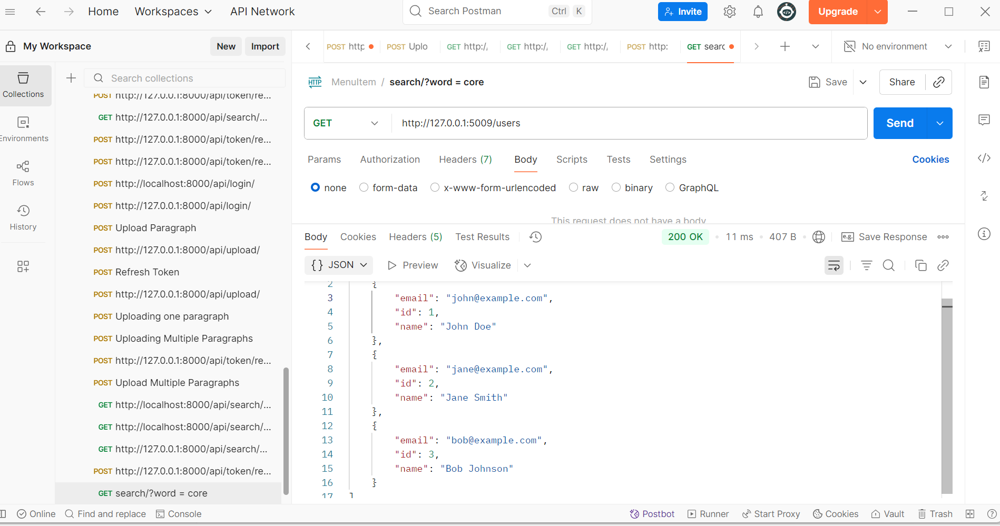

### ❌ All Users Error (400)
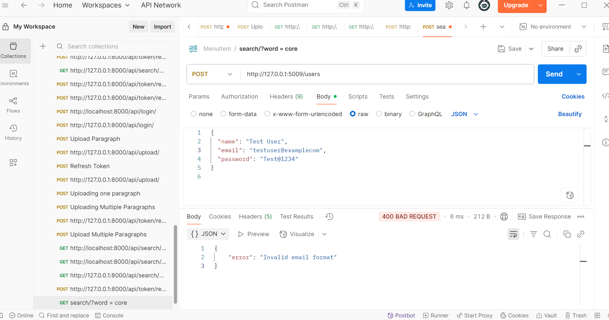
